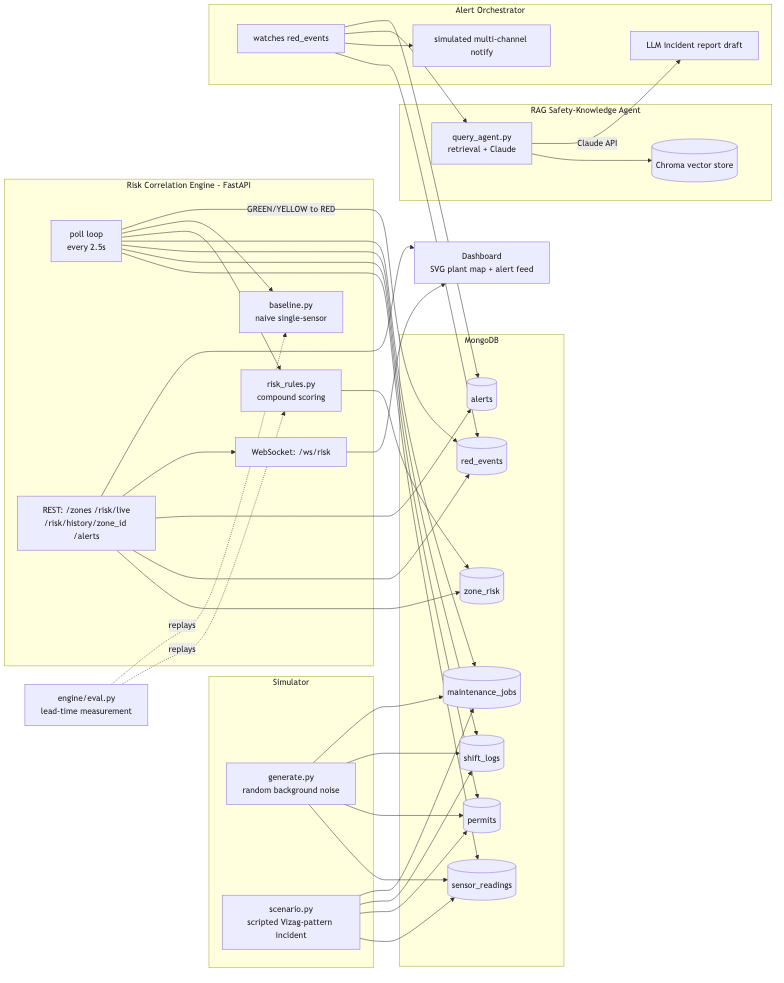
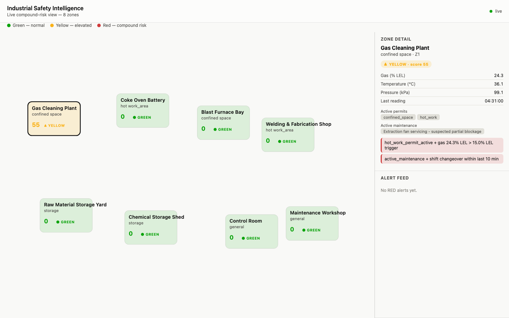
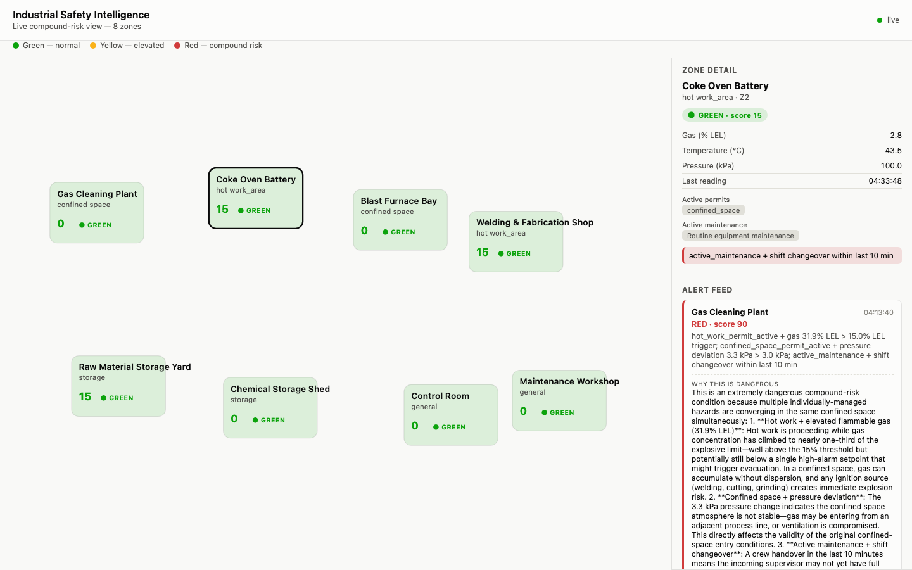

# Industrial Safety Intelligence

**An AI-powered compound-risk detection platform for zero-harm industrial operations.**

Built for **ET AI Hackathon 2.0 — Phase 2: Build Sprint**, Problem Statement:
*"AI-Powered Industrial Safety Intelligence for Zero-Harm Operations."*

> **TL;DR** — Individually-normal plant conditions (an open work permit, a gas
> reading below alarm, a routine shift changeover) can combine into a lethal
> condition that no single sensor would ever flag. This platform correlates
> permits, sensor readings, maintenance state, and shift changes in real time,
> flags the compound pattern **19.3 minutes before** a conventional
> single-sensor alarm would fire for the same incident, and explains *why*
> using real safety regulations and matched historical near-miss patterns —
> all measured from an actual, reproducible run, not estimated.

---

## Table of contents

- [The problem](#the-problem)
- [What this platform does](#what-this-platform-does)
- [Measured results](#measured-results)
- [Architecture](#architecture)
- [Component breakdown](#component-breakdown)
- [Screenshots](#screenshots)
- [Compound risk scoring — the actual rules](#compound-risk-scoring--the-actual-rules)
- [Regulatory grounding](#regulatory-grounding)
- [Technology stack](#technology-stack)
- [Repo layout](#repo-layout)
- [Setup](#setup)
- [Running the demo](#running-the-demo)
- [Reproducing the measured result](#reproducing-the-measured-result)
- [Coverage of the problem statement's suggested build areas](#coverage-of-the-problem-statements-suggested-build-areas)
- [Roadmap](#roadmap)
- [Honest limitations](#honest-limitations)
- [License](#license)

---

## The problem

Indian industrial facilities already collect abundant safety data: gas
sensors, permit-to-work logs, maintenance records, shift rosters. What's
missing is a layer that connects them.

On **20 January 2025**, this exact gap was implicated in **8 worker
fatalities** at RINL Visakhapatnam Steel Plant's Gas Cleaning Plant. Public
reporting describes individually-unremarkable conditions — an active work
permit, gas sensor readings each within their own limits, a routine shift
changeover — combining in the same area without any single system flagging
the compound state.

This is not a one-off. It's the specific failure mode that:

- **OISD-STD-105** (Work Permit System) addresses by requiring a *combined*
  permit and a simultaneous-operations (SIMOPS) cross-check whenever hot work
  and confined-space entry overlap in one area.
- **Section 41H of the Factories Act, 1948** addresses by giving workers an
  explicit statutory right to escalate "imminent danger" *before* any single
  published limit is crossed.

Existing point systems each see one slice of the picture and miss the rest:

| Existing system | What it sees | What it misses |
|---|---|---|
| Gas detection panel | Gas concentration vs. its own high-alarm threshold | Whether a hot-work or confined-space permit is active in the same zone |
| Permit-to-work register | Which permits are open, by whom, until when | Whether real-time plant conditions have changed since the permit was issued |
| Maintenance / CMMS | Which jobs are in progress | Whether a shift changeover is happening mid-job, or correlates with a nearby permit |
| Shift log / handover book | Who changed over, when | Whether the changeover coincides with any open hazardous permit or abnormal reading |

## What this platform does

Industrial Safety Intelligence is the connecting layer: it watches sensor
readings, active permits, maintenance jobs, and shift events **per plant
zone**, computes a live 0–100 compound-risk score using explicit, auditable
weighted rules, and — the instant that score crosses into the critical band —

1. **Explains why**, in plain language, grounded in retrieved regulation text
   and matched near-miss history (via a RAG agent), never inventing a
   citation it can't support.
2. **Simulates the alert cascade** — multi-channel notification to the
   control room, shift supervisor, safety officer, and emergency response
   team.
3. **Auto-drafts a preliminary incident report** in a regulatory-style format
   (Zone / Time Detected / Conditions Detected / Regulation Matched / Similar
   Past Incident / Recommended Immediate Action), timing the full
   "chaos → coordinated response" latency.
4. **Surfaces all of it live** on an operations dashboard: a color-coded
   plant layout, per-zone drill-down, and an alert feed — including alerts
   from before the page was opened.

Every rule, every threshold, and every number in this document is
inspectable in the code and reproducible by running the platform yourself.

## Measured results

`engine/eval.py` is the single most important artifact here. It runs a
scripted, Vizag-pattern incident scenario, then replays the **actual
production scoring functions** — not a re-implementation — point-in-time
over every generated sensor reading, using exactly the permits, maintenance
jobs, and shift events that were genuinely active at each historical moment.

| Metric | Value |
|---|---|
| **(a)** Compound engine first flags RED | score 75/100 — hot-work+gas and confined-space+pressure rules fire together |
| **(b)** Naive single-sensor baseline fires | when gas alone crosses **50.6% LEL** (its own 50% LEL high-alarm threshold) |
| **(c)** Lead time gained by the compound engine | **19.3 minutes** |

At the exact moment the compound engine already flags RED, the single gas
sensor alone reads **30.9% LEL** — nowhere near its own alarm. A conventional
panel would show nothing unusual for another 19 minutes. See
[`docs/eval_results.md`](docs/eval_results.md) for the full write-up.

This has also been verified **live, end-to-end, against real AWS Bedrock
(Claude) calls** — not mocked. Measured "chaos to coordinated response" time
(RED detected → RAG explanation → incident report drafted) was **25–44
seconds** across multiple live runs.

## Architecture



Five independently-runnable components, connected through a shared MongoDB
data layer:

```
Simulator ──writes──▶ MongoDB ◀──polls── Risk Correlation Engine (FastAPI)
                          ▲                        │ GREEN/YELLOW → RED
                          │                        ▼
                     Dashboard ◀──REST/WS── red_events ──watched by── Alert Orchestrator
                                                                            │
                                                          ┌─────────────────┴─────────────────┐
                                                          ▼                                     ▼
                                          RAG Safety-Knowledge Agent                 Simulated multi-channel notify
                                          (Chroma + Claude via Bedrock)              + LLM incident report draft
```

## Component breakdown

| # | Component | Path | What it does |
|---|---|---|---|
| 1 | **Data Simulator** | `simulator/` | Generates realistic `sensor_readings`, `permits`, `shift_logs`, and `maintenance_jobs` for 8 plant zones — steady-state background noise (`generate.py --mode=random`) and a scripted, reproducible Vizag-pattern compound incident (`scenario.py` / `generate.py --mode=scenario`). |
| 2 | **Risk Correlation Engine** | `engine/` | FastAPI service polling every 2.5s. `risk_rules.py` computes the live compound score; `baseline.py` runs the naive single-sensor comparison in parallel. Exposes `GET /zones`, `/risk/live`, `/risk/history/{zone_id}`, `/alerts`, and `WS /ws/risk`. `eval.py` is the reproducible lead-time measurement harness. |
| 3 | **RAG Safety-Knowledge Agent** | `rag/` | `ingest.py` builds a local Chroma vector store from `rag/corpus/` (no paid API needed — embeddings run locally via sentence-transformers). `query_agent.py` retrieves the most relevant context on a RED trigger and asks Claude for a structured `{explanation, cited_regulation, similar_past_incident, confidence}` response, grounded only in retrieved text. |
| 4 | **Alert Orchestrator** | `orchestrator/` | Watches `red_events` for new GREEN/YELLOW → RED transitions, simulates the multi-channel alert cascade, calls the RAG agent, drafts a preliminary incident report via an LLM call, and records the full detection-to-report timeline. |
| 5 | **Live Dashboard** | `dashboard/` | Zero-build-step HTML/JS: an SVG plant layout with all 8 zones color-coded by live risk band, a zone-detail panel (readings, active permits, active maintenance, triggered rules), and an alert feed showing the RAG explanation + drafted report for every RED event — including historical ones pulled from `/alerts` on page load. |

## Screenshots

**Mid-incident — compound signal visible before any single threshold trips.**
The Gas Cleaning Plant is at YELLOW (score 55) with two rules already
stacking (hot-work + rising gas, maintenance + shift changeover), while every
other zone stays GREEN:



**After RED — the alert feed shows Claude's actual generated explanation**,
citing OISD-STD-105's combined-permit requirement and matching the entry
modeled on the Vizag GCP incident pattern:



## Compound risk scoring — the actual rules

Scoring is deliberately simple, explicit, and auditable: every point on the
0–100 score traces back to a named rule and the exact reading that triggered
it. In a safety-critical system, a safety officer must be able to see *why*
an alert fired, not just trust a black box.

| Rule | Condition | Weight |
|---|---|---|
| Hot-work + rising gas | Active hot-work permit **and** gas > 30% of the published high-alarm threshold (an early-warning band, well below the alarm itself) | **+40** |
| Confined-space + abnormal pressure | Active confined-space permit **and** duct/vessel pressure deviates > 3 kPa from ambient baseline (ventilation-fault signature) | **+35** |
| Maintenance + shift changeover | Active maintenance job **and** a shift changeover logged within the last 10 minutes (continuity-of-awareness risk) | **+15** |

Rules **stack** — a zone accumulates the weight of every condition true at
once, capped at 100. Score ≥ 70 → **RED**, ≥ 40 → **YELLOW**, else **GREEN**.
The naive baseline, for comparison, only checks gas concentration against the
single published high-alarm threshold — exactly what a conventional gas
detector panel does today.

Thresholds (10–20% LEL low alarm, 40–60% LEL high alarm) follow widely
published industrial LEL gas-alarm convention consistent with OISD-STD-105/163
principles — see the `_citation_status` field in [`thresholds.json`](thresholds.json)
for full sourcing transparency; nothing is invented.

## Regulatory grounding

`rag/corpus/` grounds every generated explanation in real regulatory text —
the RAG agent's system prompt explicitly instructs it to use only retrieved
context and lower its confidence rather than invent a citation.

| Source | Coverage |
|---|---|
| **OISD-STD-105** — Work Permit System | Compiled summary (current edition Aug 2023): permit types, the combined hot-work/confined-space permit requirement, SIMOPS cross-check, gas testing, issuer/receiver responsibility, shift-handover continuity. |
| **OISD-STD-163** — Safety of Control Room for Hydrocarbon Industry | Compiled summary (current edition Jun 2024): siting/setback distance, blast/fire-resistant construction, pressurization and gas-ingress control, perimeter detection. |
| **Factories Act 1948, Chapter IV-A** | Verified, sourced text of **Sections 41A–41H** (Site Appraisal Committees, compulsory disclosure, occupier responsibility, Inquiry Committee powers, emergency standards, exposure limits, workers' safety-committee participation, and the right to warn of imminent danger). |
| **Synthetic near-miss corpus** | 24 illustrative near-miss reports across all four hazard classes, including one explicitly modeled on public reporting of the Jan 2025 Vizag GCP incident, framed non-speculatively. |

> **Sourcing integrity note:** OISD standards are sold by OISD, not freely
> published, so the two OISD documents above are original compiled summaries
> of verified public scope information (cross-checked against oisd.gov.in's
> own standards listing) — not verbatim reproductions of copyrighted clause
> text. The Factories Act text, being public legislation, is sourced and
> verified directly against indiacode.nic.in / advocatekhoj.com.

## Technology stack

| Layer | Technology |
|---|---|
| Backend / API | Python 3.11, FastAPI, Motor (async MongoDB driver), WebSockets |
| Data store | MongoDB (local for dev; MongoDB Atlas free tier for production/demo) |
| Compound risk scoring | Explicit weighted-rule engine — no black-box ML in the critical detection path, by design, for auditability |
| RAG / retrieval | LangChain + ChromaDB (local vector store), sentence-transformers (`all-MiniLM-L6-v2`) — no paid API for embeddings |
| LLM generation | Claude (Sonnet) via **AWS Bedrock** (bearer-token auth), with the direct Anthropic API as a fallback path |
| Frontend | Vanilla HTML/CSS/JS, live WebSocket client, SVG plant-layout visualization — zero build step |
| Tooling | `uv` for Python env/dependency management, mocked integration checks, Playwright for automated UI verification |

## Repo layout

```
industrial-safety-intelligence/
├── simulator/            # zones.json, random-noise generator, scripted incident
│   ├── zones.json
│   ├── generate.py
│   └── scenario.py
├── engine/                # FastAPI risk correlation engine, rules, baseline, eval
│   ├── main.py
│   ├── risk_rules.py
│   ├── baseline.py
│   ├── config.py
│   └── eval.py
├── rag/                   # Chroma ingestion + Claude-backed safety-knowledge agent
│   ├── ingest.py
│   ├── query_agent.py
│   └── corpus/            # OISD summaries, Factories Act text, synthetic near-misses
├── orchestrator/          # watches RED events, drafts alerts + incident reports
│   └── alert_orchestrator.py
├── dashboard/              # static HTML/JS live plant map
│   ├── index.html
│   └── app.js
├── thresholds.json         # shared gas/pressure/temp thresholds + rule weights
└── docs/
    ├── architecture.png
    ├── eval_results.md
    └── screenshots/
```

## Setup

Requires **Python 3.11** (not 3.13/3.14 — some dependencies, like ChromaDB
and torch, don't ship wheels for very new Python versions yet).

```bash
# 1. MongoDB: either run one locally (e.g. `brew install mongodb-community@7.0`,
#    then `mongod --dbpath /path/to/data --port 27017 &`) or create a free
#    MongoDB Atlas cluster and point MONGODB_URI in .env at it. Defaults to
#    mongodb://127.0.0.1:27017 if you don't set it.

# 2. Python env
uv venv --python 3.11 .venv
uv pip install -p .venv -r requirements.txt
# (no `uv`? plain `python3.11 -m venv .venv && pip install -r requirements.txt` works too)
# for an exact reproduction of the versions this was built/tested against,
# use requirements-lock.txt instead

# 3. Configure secrets (never commit .env)
cp .env.example .env
# edit .env: set MONGODB_URI if not using local Mongo, and either:
#   - ANTHROPIC_API_KEY (direct Anthropic API), or
#   - AWS_BEDROCK_BEARER_TOKEN + BEDROCK_MODEL_ID + AWS_REGION (AWS Bedrock --
#     takes priority over ANTHROPIC_API_KEY when both are set; this is what
#     the project was actually built and demoed against)

# 4. Build the RAG vector index (one-time, or whenever rag/corpus/ changes).
# Embeddings run locally -- no paid API needed for this step.
.venv/bin/python rag/ingest.py
```

## Running the demo

Open five terminals (or background each with `&`):

```bash
# 1. Background plant noise across the other 7 zones
.venv/bin/python simulator/generate.py --mode=random --exclude-zones Z1

# 2. Risk correlation engine (REST + WebSocket on :8000)
cd engine && ../.venv/bin/python -m uvicorn main:app --host 127.0.0.1 --port 8000

# 3. Alert orchestrator (watches for RED, drafts reports)
.venv/bin/python orchestrator/alert_orchestrator.py

# 4. Dashboard
cd dashboard && python3 -m http.server 8080
# open http://localhost:8080/index.html

# 5. The scripted incident -- start this LAST, once 1-4 are up
.venv/bin/python simulator/generate.py --mode=scenario
```

Watch the Gas Cleaning Plant zone climb GREEN → YELLOW → RED as the scripted
incident plays out (~3 minutes total), with the alert feed populating with
the RAG agent's explanation, cited regulation, and matched near-miss pattern
roughly 25–40 seconds after RED. Refreshing the dashboard afterward still
shows the historical alert — it isn't lost if you weren't watching live.

## Reproducing the measured result

```bash
.venv/bin/python engine/eval.py
```

This runs the same scripted incident in a dedicated `<db>_eval` database
(never touches your live demo data) and replays the actual rule/baseline
functions point-in-time to print and save the exact detection-lead-time
result to `eval_output/latest_run.json`.

## Coverage of the problem statement's suggested build areas

The brief lists six illustrative areas. We built four of them deep and
working end-to-end, rather than all six shallow — an honest accounting:

| Suggested area | Status | Where |
|---|---|---|
| Compound Risk Detection Engine | ✅ Built, fully working | `engine/risk_rules.py` |
| Digital Permit Intelligence Agent | ✅ Built, fully working | Same engine — cross-checks permit type against live readings in the same zone |
| Incident Pattern Intelligence | ✅ Built, fully working | `rag/query_agent.py` + `rag/corpus/` |
| Emergency Response Orchestrator | ✅ Built, fully working | `orchestrator/alert_orchestrator.py` |
| Geospatial Safety Heatmap | 🟡 Partially addressed | Dashboard's SVG plant layout is a static-geometry live-risk view; no live worker-location ingestion yet |
| Quality & Compliance Audit Agent | ⬜ Out of scope this phase | Natural extension of the existing RAG/citation pipeline — see Roadmap |

## Roadmap

- **Geospatial worker-location overlay** — ingest live worker-tracking
  (BLE/UWB tags or CCTV-derived position) onto the existing SVG plant layout.
- **Computer-vision CCTV analytics** — a new signal source (PPE
  non-compliance, unauthorized zone entry) feeding the same risk engine;
  `risk_rules.py`'s rule format is designed to accept new signals without
  restructuring existing ones.
- **Quality & Compliance Audit Agent** — reuse the existing RAG corpus and
  retrieval pipeline, adding a document-comparison pass against inspection
  and compliance records.
- **Knowledge graph of equipment–permit–risk relationships** — a natural
  next step as the number of zones/equipment types grows beyond what flat
  JSON configuration comfortably expresses.
- **Multi-plant deployment** — `zones.json` and `thresholds.json` are the
  *only* plant-specific configuration; onboarding a new facility means
  authoring these two files, not touching engine, RAG, or orchestrator code.

## Honest limitations

- Results above are from a scripted, controlled incident timeline designed
  to demonstrate the detection *mechanism* clearly — not a retrospective
  replay of real plant telemetry. The validated claim is the qualitative
  one (compound correlation catches sub-threshold combinations single
  sensors cannot), not a guarantee of an identical lead time on every plant.
- Rule weights and thresholds are transparent, tunable defaults — not values
  fitted to any specific facility's historical incident data. A production
  deployment should calibrate them against that facility's own near-miss
  history.
- Geospatial worker-tracking, CCTV computer vision, and the Quality &
  Compliance Audit Agent are roadmap items, not delivered in this prototype.
- The Alert Orchestrator's multi-channel notification (SMS, pager) is
  simulated/logged, not wired to a real telecom gateway — appropriate for a
  hackathon prototype, not a claim of production integration.

## License

Built for ET AI Hackathon 2.0. No license file included yet — treat as
all-rights-reserved by the author pending an explicit license decision.
