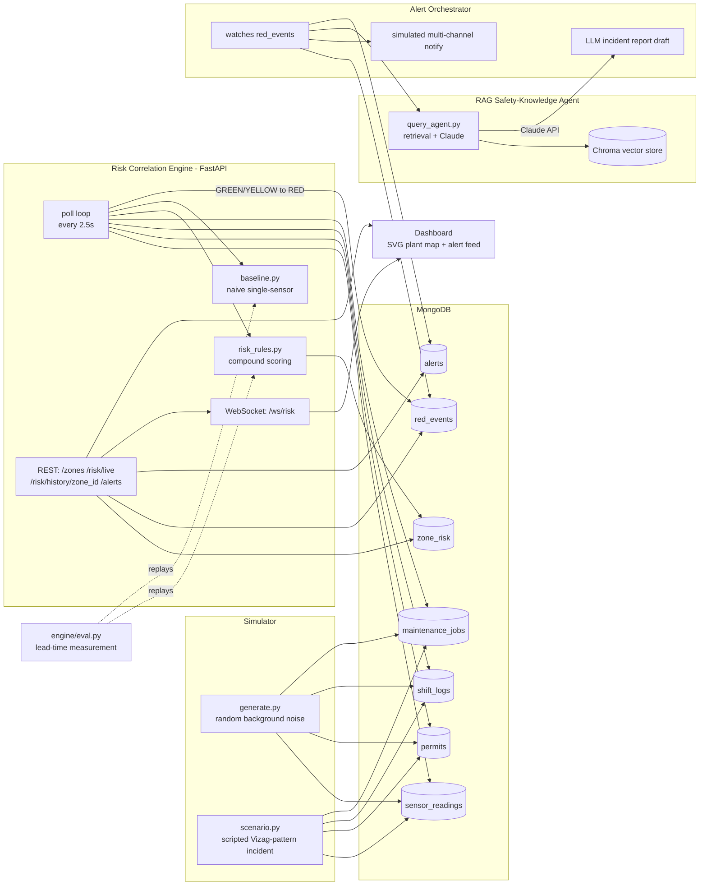

# Industrial Safety Intelligence

**AI-powered compound-risk detection for zero-harm operations.**
Built for the ET AI Hackathon 2026, Problem Statement #1.

Indian factories already have plenty of safety data — gas sensors, permit-to-work
logs, shift rosters, maintenance records. Individually-normal readings can combine
into a lethal condition that no single sensor would ever flag. This project is the
"connecting layer": it correlates permits, sensor readings, maintenance state, and
shift changes in real time, flags the compound pattern well before any single
threshold would trip, and explains *why* using real safety regulations and
near-miss patterns.

The scripted demo scenario is modeled on the pattern behind the RINL
Visakhapatnam Steel Plant Gas Cleaning Plant incident (Jan 2025, 8 fatalities):
a confined-space entry permit, a hot-work permit, degrading ventilation, and a
shift changeover all overlapping in one zone.

## Measured result

Running the scripted incident through both the compound engine and a naive
single-sensor baseline (see [`docs/eval_results.md`](docs/eval_results.md) for
the full write-up and exact numbers from `engine/eval.py`):

| | |
|---|---|
| Compound engine flags RED | ~25.3 simulated minutes into the incident |
| Naive single-sensor baseline fires | ~44.7 simulated minutes in |
| **Lead time gained** | **19.3 minutes** |

## Architecture



## Repo layout

```
industrial-safety-intelligence/
├── simulator/       # zones.json, random-noise generator, scripted incident
├── engine/          # FastAPI risk correlation engine, rules, baseline, eval
├── rag/             # Chroma ingestion + Claude-backed safety-knowledge agent
├── orchestrator/    # watches RED events, drafts alerts + incident reports
├── dashboard/       # static HTML/JS live plant map
├── thresholds.json  # shared gas/pressure/temp thresholds + rule weights
└── docs/            # eval results write-up, this diagram
```

## Setup

Requires Python 3.11 (not 3.14 — some dependencies here don't yet ship 3.14 wheels).

```bash
# 1. MongoDB: either run one locally (e.g. `brew install mongodb-community@7.0`,
# then `mongod --dbpath /path/to/data --port 27017 &`) or create a free MongoDB
# Atlas cluster and point MONGODB_URI in .env at it. Defaults to
# mongodb://127.0.0.1:27017 if you don't set it.

# 2. Python env
uv venv --python 3.11 .venv
uv pip install -p .venv -r requirements.txt
# for an exact reproduction of the versions this was built/tested against,
# use requirements-lock.txt instead

# 3. Configure secrets (never commit .env)
cp .env.example .env
# edit .env: set ANTHROPIC_API_KEY, and MONGODB_URI if not using local Mongo

# 4. Build the RAG vector index (one-time, or whenever rag/corpus/ changes)
.venv/bin/python rag/ingest.py
```

## Running the demo

Open four terminals (or background each with `&`):

```bash
# Background plant noise across the other 7 zones
.venv/bin/python simulator/generate.py --mode=random --exclude-zones Z1

# The scripted incident, in the Gas Cleaning Plant zone
.venv/bin/python simulator/generate.py --mode=scenario

# Risk correlation engine (REST + WebSocket on :8000)
cd engine && ../.venv/bin/python -m uvicorn main:app --port 8000

# Alert orchestrator (watches for RED, drafts reports)
.venv/bin/python orchestrator/alert_orchestrator.py
```

Then serve and open the dashboard:

```bash
cd dashboard && python3 -m http.server 8080
# open http://localhost:8080/index.html
```

Watch the Gas Cleaning Plant zone climb from GREEN through YELLOW to RED as the
scripted incident plays out, with the alert feed populating with the RAG
agent's explanation, cited regulation, and matched near-miss pattern.

To reproduce the measured lead-time number without waiting on the live demo:

```bash
.venv/bin/python engine/eval.py
```

This runs the same scripted incident in a dedicated `<db>_eval` database (never
touches your live demo data) and replays the actual rule/baseline functions
point-in-time to print and save the exact detection-lead-time result.

## Safety-threshold sourcing

`thresholds.json` uses widely-published industrial LEL gas-alarm conventions
(low alarm 10-20% LEL, high alarm 40-60% LEL), consistent with OISD-STD-105 and
OISD-STD-163 principles. See the `_citation_status` field in that file and
`rag/corpus/` for the regulation summaries the RAG agent actually cites from.
